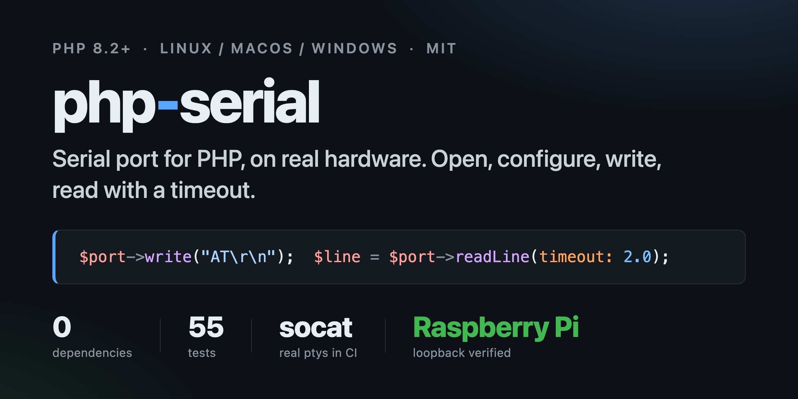

# php-serial



[](https://github.com/sanchescom/php-serial/actions/workflows/ci.yml)
[](https://packagist.org/packages/sanchescom/php-serial)
[](https://packagist.org/packages/sanchescom/php-serial)
[](https://packagist.org/packages/sanchescom/php-serial)
[](LICENSE.md)

Serial port for PHP 8.2+: open, configure, write, read with a timeout. Linux, macOS, Windows.
No extensions, no dependencies.

One object opens the device and applies the line settings (`stty` on Linux and macOS, `mode` on
Windows); after that it is `write()` and `readLine(timeout: …)`. The timeout is the point: every
read call says how long it may wait, `TimeoutException` is a real exception, and bytes that arrived
before the deadline are kept for the next call. The suite runs on real pseudo-terminals through
`socat`, and every release is verified on a Raspberry Pi UART before it is tagged; the transcript
is in [`docs/verified-on.md`](docs/verified-on.md).

## Loopback on a Raspberry Pi


Run over SSH on the maintainer's Pi as an unprivileged user (`femus`, member of `dialout`), GPIO14
jumpered to GPIO15, full transcript in [`docs/verified-on.md`](docs/verified-on.md):

```
$ php examples/loopback.php /dev/serial0 115200
Opened /dev/serial0 at 115200
readLine: 'ping'
timeout: No "\n" received within 0.500 s
readAvailable: ''
[exit 0]

$ php examples/at-command.php /dev/serial0 115200
< AT
No answer within 2 s
[exit 0]
```

The second run shows what a timeout looks like against a device that never answers: the loopback
echoes `AT` back, then `readLine(timeout: 2.0)` throws after two seconds instead of hanging.

## Install

```bash
composer require sanchescom/php-serial
```

## Usage

The constructor opens the device and applies the line settings; everything after that is reading and
writing bytes. This is `examples/at-command.php`:

```php
<?php

declare(strict_types=1);

// Talk to a modem or an ESP8266 with AT firmware:
//   php examples/at-command.php /dev/ttyUSB0 115200

require __DIR__ . '/../vendor/autoload.php';

use Sanchescom\Serial\SerialException;
use Sanchescom\Serial\SerialPort;
use Sanchescom\Serial\SerialPortLocator;
use Sanchescom\Serial\TimeoutException;

$device = $argv[1] ?? (new SerialPortLocator())->candidates()[0] ?? null;
if ($device === null) {
    fwrite(STDERR, "No serial device found\n");
    exit(1);
}

try {
    $port = new SerialPort($device, (int) ($argv[2] ?? 115200));
    $port->write("AT\r\n");

    try {
        do {
            $line = $port->readLine(timeout: 2.0);
            echo "< {$line}\n";
        } while ($line !== 'OK' && $line !== 'ERROR');
    } catch (TimeoutException) {
        echo "No answer within 2 s\n";
    }

    $port->close();
} catch (SerialException $e) {
    fwrite(STDERR, $e->getMessage() . "\n");
    exit(1);
}
```

Named arguments keep a full configuration readable (`Parity`, `StopBits` and `FlowControl` live in
the same namespace):

```php
use Sanchescom\Serial\{FlowControl, Parity, StopBits};

$port = new SerialPort(
    '/dev/ttyUSB0',
    baudRate: 9600,
    dataBits: 7,
    parity: Parity::Even,
    stopBits: StopBits::Two,
    flowControl: FlowControl::XonXoff,
);
```

The reading methods differ only in when they stop waiting:

- `write(string $bytes): void` — writes everything before returning.
- `readLine(float $timeout, string $eol = "\n"): string` — one line, trailing carriage returns removed, so `"OK\r\n"` reads as `"OK"`.
- `readUntil(string $delimiter, float $timeout): string` — bytes up to the delimiter; the delimiter is consumed and anything after it stays buffered for the next call.
- `read(int $maxLength, float $timeout): string` — up to `$maxLength` bytes, waiting at most `$timeout` seconds for the first one.
- `readAvailable(): string` — everything received so far, without waiting.
- `stream()` — the underlying non-blocking resource, for `stream_select()` or an event loop. Reading it directly bypasses the internal buffer, so do not mix it with the `read*` methods.
- `close(): void` — closes the port; later reads and writes throw a `SerialException`.

## Settings

| Parameter | Type | Default | Values |
| --- | --- | --- | --- |
| `$device` | `string` | — | `/dev/ttyUSB0`, `/dev/cu.usbserial-1410`, `COM3` (also `COM3:` and `\\.\COM3`) |
| `$baudRate` | `int` | `57600` | any positive integer the driver accepts: 300, 1200, 9600, 19200, 38400, 57600, 115200, … |
| `$dataBits` | `int` | `8` | `5`, `6`, `7`, `8` |
| `$parity` | `Parity` | `Parity::None` | `Parity::None`, `Parity::Even`, `Parity::Odd` |
| `$stopBits` | `StopBits` | `StopBits::One` | `StopBits::One`, `StopBits::Two` |
| `$flowControl` | `FlowControl` | `FlowControl::None` | `FlowControl::None`, `FlowControl::RtsCts`, `FlowControl::XonXoff` |

A baud rate below 1 or a data-bits value outside 5–8 throws an `\InvalidArgumentException`. A device
that cannot be opened, or a `stty`/`mode` call that fails, throws a `SerialException`.

## Timeouts

Timeouts are per call, in seconds, and accept fractions (`0.25` is 250 ms). A negative timeout throws
an `\InvalidArgumentException`.

- `read()` returns an empty string when nothing arrived in time. There is no exception: an empty read
  is a normal answer for a device that had nothing to say.
- `readUntil()` and `readLine()` throw a `TimeoutException` (which extends `SerialException`) when the
  delimiter has not arrived in time. Whatever did arrive stays in the internal buffer, so a longer
  retry continues where the previous call stopped instead of losing the partial message.
- `readAvailable()` never waits and never times out.
- `write()` takes no timeout: it returns once every byte is gone. If the port accepts nothing at
  all for one second — flow control asserted, device unplugged — it gives up with a `SerialException`.
- If the other end closes the port while `read()`, `readUntil()` or `readLine()` is waiting, it throws
  a `SerialException` rather than returning an empty string or a `TimeoutException`. `readAvailable()`
  does not throw: check `feof($port->stream())` when you need to see that the port is gone.
- A zero timeout polls the device once and never waits: whatever has already arrived is used, and
  `readUntil()` and `readLine()` throw a `TimeoutException` straight away when the delimiter is not
  there yet.

## Finding ports

`SerialPortLocator::candidates()` returns a sorted, unique list of devices that look openable. It is a
candidate list, not a detector: nothing is opened and nothing is probed.

```php
$devices = (new SerialPortLocator())->candidates();
```

- macOS: `/dev/cu.usbserial*`, `/dev/cu.usbmodem*`, `/dev/cu.wchusbserial*`, `/dev/cu.*`
- Linux: `/dev/ttyUSB*`, `/dev/ttyACM*`, `/dev/rfcomm*`, `/dev/serial*`, `/dev/ttyS*`
- Windows: the `COMn` values under the registry key `HKLM\HARDWARE\DEVICEMAP\SERIALCOMM`, read with
  `reg query`

Entries containing `Bluetooth-Incoming`, `debug` or `wlan` are dropped, because they are never the
port you meant.

## Platforms

| Platform | Configured with | Device name | Status |
| --- | --- | --- | --- |
| Linux | `stty -F <device> …` | `/dev/ttyUSB0`, `/dev/serial0` | Verified on a Raspberry Pi, see [docs/verified-on.md](docs/verified-on.md) |
| macOS | `stty -f <device> …` | `/dev/cu.usbserial-1410` | Verified through `socat` pseudo-terminals in the test suite |
| Windows | `mode COMn BAUD=… …` | `COM3`, opened as `\\.\COM3` | Written and unit-tested, **not yet verified on hardware**; read timeouts are not enforced |

On Windows PHP cannot `stream_select()` a file handle and non-blocking mode is not implemented for
one, so `read()`, `readUntil()` and `readLine()` do not enforce their `$timeout` there: `fread()`
blocks according to the COM port's own timeouts. `readUntil()` and `readLine()` stop at the deadline
once `fread()` returns; `read()` blocks inside `fread()` for as long as the driver takes. Everything
else — opening, configuring, writing, buffering — works the same way on all three platforms.

## How it works

The device is opened with `fopen()` first and configured second, because on macOS the termios
settings applied by `stty` are discarded once the device is fully closed; holding the handle open
while `stty` runs is what makes them stick. The same order is used on Linux, where it is harmless.

The `stty` command starts with `raw -echo` and puts the explicit flags after it, so the explicit
flags win. This matters on both systems for different reasons: on macOS `raw` is `cfmakeraw()`, which
would otherwise reset `cs8` and the parity bits, and on GNU `stty` it resets `ixon`/`ixoff`, which
would otherwise undo the requested flow control.

On Windows the port is opened as `\\.\COMn` and configured with
`mode COMn BAUD=… PARITY=… DATA=… STOP=… xon=… octs=… rts=… dtr=on to=off`.

No PHP extension is required: the library uses plain stream functions plus one external command per
port. That command runs through `exec()`, so on a hardened installation where `exec()` is in
`disable_functions` the constructor throws a `SerialException` saying exec() is disabled instead of
dying with a fatal error.

## Upgrading from 2.x

3.0 is a rewrite with a different API. See [UPGRADE.md](UPGRADE.md) for the method-by-method mapping.

## Origin and license

Versions 1.x and 2.x were a refactoring of [Xowap/PHP-Serial](https://github.com/Xowap/PHP-Serial)
and were licensed under GPL-3.0. Version 3.0 was written from scratch and is licensed under the MIT
License, see [LICENSE.md](LICENSE.md). No code from 2.x or from PHP-Serial remains.

## Contributing

See [CONTRIBUTING.md](CONTRIBUTING.md). Before sending a pull request:

```bash
composer lint && composer analyse && composer test
```

The pseudo-terminal tests need `socat` (`brew install socat` / `apt install socat`); they are skipped
when it is missing.
